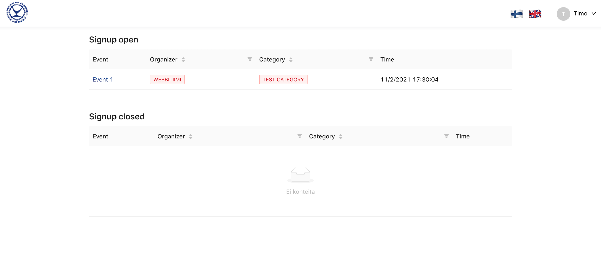

## About 
Ilmo3 is the upcoming event registration system for the guild of Industrial Engineering and Management students Prodeko. The old system [ilmo.prodeko.org](https://ilmo.prodeko.org) developed in 2012 using PHP is in need of some refreshment. The project is based on database-driven development. Creating a database table automatically reflects the changes onto the GraphQL API and generates React hooks for fetching the data.

## Technologiess
React, GraphQL, PostGraphile, Next.js, TypeScript. Developed and deployed with Docker. Repository: https://github.com/prodeko/ilmo.

## Features
- Backend built with [Posgraphile](https://www.graphile.org/postgraphile/)
- Frontend built with [React](https://reactjs.org/), [TypeScript](https://www.typescriptlang.org/) and [Next.js](https://nextjs.org/)
- OAuth integration with Prodeko authentication
- [Graphile-worker](https://github.com/graphile/worker) for recurring tasks
- [Graphile-migrate](https://github.com/graphile/migrate) for database migrations
- [GraphQL](https://graphql.org/) for the API
- [AntD](https://ant.design/) design system
- [babel](https://babeljs.io/) code transpilation
- [ESLint](https://eslint.org/) code style and linting
- [Redis](https://redis.io/) caching
- [Fastify](https://www.fastify.io/) backend server
- [Jest](https://jestjs.io/) unit testing
- [Cypress](https://www.cypress.io/) end-to-end testing
- Automatic deployment via Github Actions CI/CD and Ansible
- Automatic SSL certificate renewal using [Caddy](https://caddyserver.com/)
