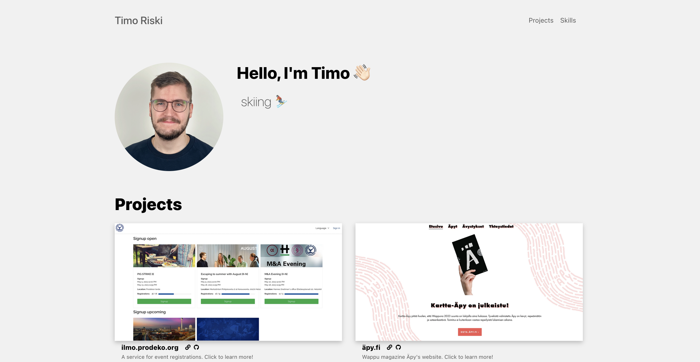

## About 
The site you're currently browsing!

## Technologies
Gatsby v2, React. Deployed using [Netlify](https://www.netlify.com/).

## Features
- Built with [gatsby v2](https://www.gatsbyjs.org/)
- Page Transitions, component-based (with no-js support)
- IntersectionObserver, component-based (with polyfill)
- React Context for global UI state, with SSR
- [styled-components](https://www.styled-components.com/) v4
- Optimized with [Google Lighthouse](https://developers.google.com/web/tools/lighthouse/) (including test)
- Code Splitting of CSS and JS (component based)
- One config file for site-wide settings
- [Prettier](https://prettier.io/) for code style
- [ESLint](https://eslint.org/) (based on eslint-plugin-react)
- Most social + meta tags in one component (head.js)
- All favicons generated, only one icon file needed
- Generated media queries for easy use
- Schema JSONLD
- Offline support
- Manifest support
- Sitemap support
- [size-plugin](https://github.com/GoogleChromeLabs/size-plugin) to keep an eye on bundle sizes
