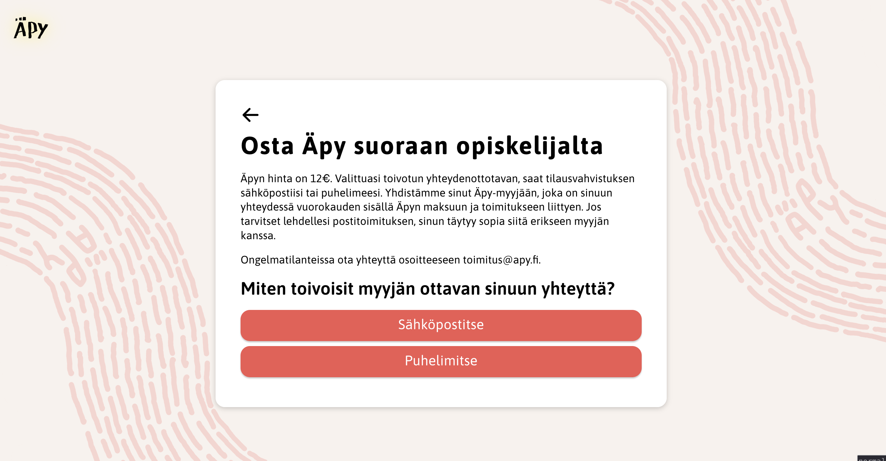

## About 
A web application to help students selling Äpy connect with buyers. The sellers share their location to a [Telegram](https://telegram.org/) bot that serves this data osta.äpy.fi front end application. The serviec is only available for one week before the May Day Celebrations in Finland.

## Technologies
React. Deployed to Deployed to AWS S3 + Cloudfront CDN using CloudFormation.

## Features
- Built with [React](https://reactjs.org/)
- CSS in JS with [styled-components](https://www.styled-components.com/)
- [Prettier](https://prettier.io/) for code style
- [ESLint](https://eslint.org/) (based on eslint-plugin-react)
- [Stylelint](https://stylelint.io/) for SCSS linting
- [Redux](https://redux.js.org/introduction/getting-started), [React hooks](https://reactjs.org/docs/hooks-intro.html) for state handlin
- Google Maps Javascript API for displaying locations
- Google Analytics event integration for key user interactions on the site
