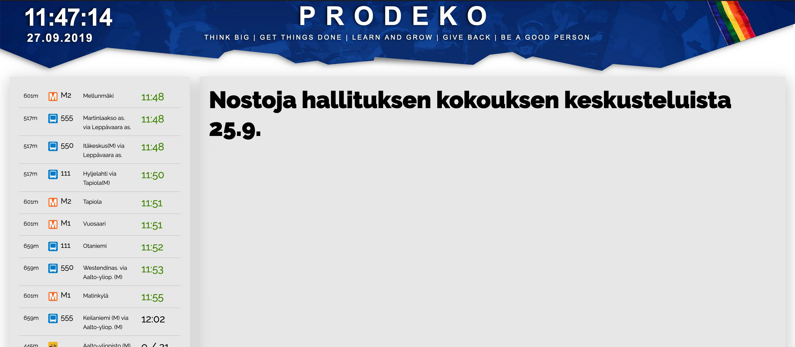

 
## About
Infoscreen is a TV screen located at Prodeko's guildroom. It is used to convey useful information such as upcoming events, student restaurant menus, public transportation timetables and general information to guildmembers.

## Technologies
Next.js, TypeScript. Deployed to Azure App Services using Github Actions. Repository: https://github.com/Prodeko/infoscreen.

## Features
- Built with [Next.js](https://nextjs.org/) + [TypeScript](https://www.typescriptlang.org/)
- Uses the [Digitransit](https://digitransit.fi/en/developers/) GraphQL API to fetch public transportation info
- Uses the API behing https://kanttiinit.fi/ to fetch student restaurant menus in Otaniemi
- [Prettier](https://prettier.io/) for code style
- [ESLint](https://eslint.org/) (based on eslint-plugin-react)