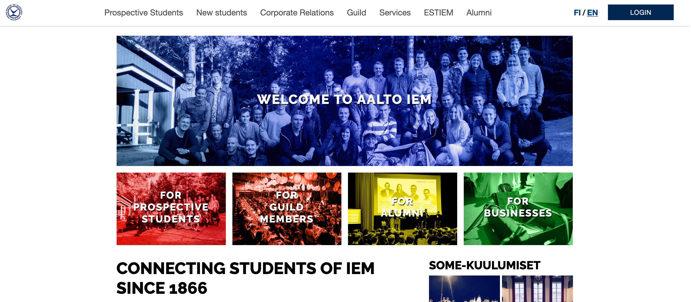

 
## About
Prodeko is the Guild of Industrial Engineering and Management students at Aalto University. The new site offers **various improvements** over the old one including **automating weekly tasks** of different board members **saving tens or hundreds of hours of work per year**. 

## Technologies
Django + DjangoCMS + MySQL + Redis. Developed using Docker. Deployed to a server through Apache. Repository: https://github.com/Prodeko/prodeko-org-djangocms.

## Features
- [django-sass-processor](https://github.com/jrief/django-sass-processor) for SCSS 
- [unittest](https://docs.python.org/3/library/unittest.html#module-unittest) for testing 
- Internationalization & localization in Finnish and English.
- Dynamic form submission + PDF generation from form data.
> *The reimbursement form is used to by guild members to reimburse expenses from the guild. The form is dynamic (e.g. form fields can be added and removed so that multiple reimbursements can be processed at once).*
- Google Drive API 
> *Downloading board meeting documents and attachments automatically.*
- Google Directory API
> *Automating the guild membership application process. Automatically managing mailing lists stored in G Suite.*
- Google Analytics
> *Configuration managed using Google Tag Manager.

## Old site
The old site ran on Wordpress and was badly outdated.

