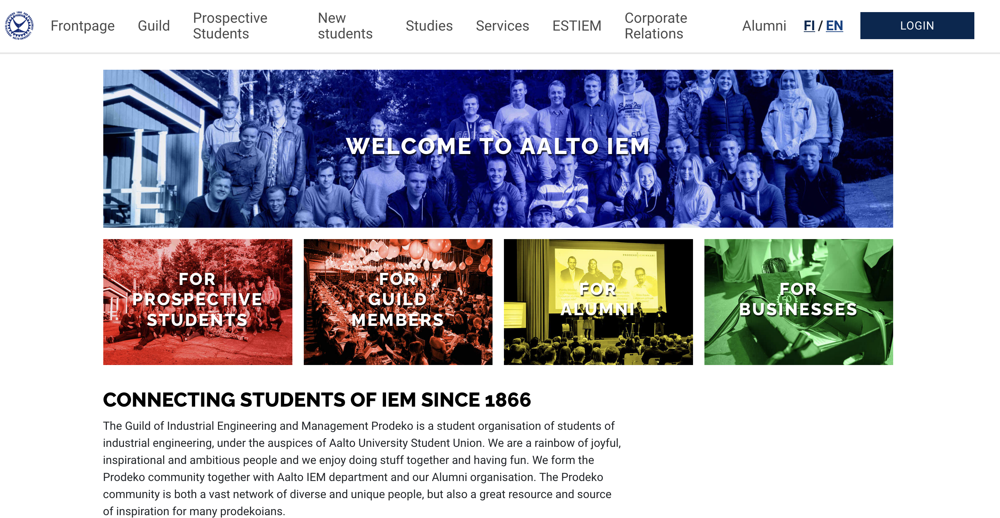

## About
Prodeko is the Guild of Industrial Engineering and Management students at Aalto University. The site enables **automating weekly tasks** of various Prodeko board members **saving tens or hundreds of hours of work per year**.

## Technologies
Django + DjangoCMS + MySQL + Redis. Developed and deployed with Docker. Repository: https://github.com/Prodeko/prodeko-org-djangocms.

## Highlights
- Built with [Django](https://www.djangoproject.com/)
- CMS with [Django CMS](https://www.django-cms.org/en/)
- [django-sass-processor](https://github.com/jrief/django-sass-processor) for SCSS
- [pytest-django](https://pytest-django.readthedocs.io/en/latest/) for testing
- Internationalization & localization in Finnish and English
- CDN hosted on Azure for site performance
- Automatic deployment via Github Actions CI/CD and Ansible
- Automatic SSL certificate renewal using [Caddy](https://caddyserver.com/)
- Dynamic form submission + PDF generation from form data
> *The reimbursement form is used by guild members to reimburse expenses from the guild. The form is dynamic (e.g. form fields can be added and removed so that multiple reimbursements can be processed at once).*
- Google Drive API
> *Downloading board meeting documents and attachments automatically.*
- Google Directory API
> *Automating the guild membership application process. Automatically managing mailing lists stored in G Suite (adding and removing members).*
- Google Analytics
> *Configuration managed using Google Tag Manager*.
