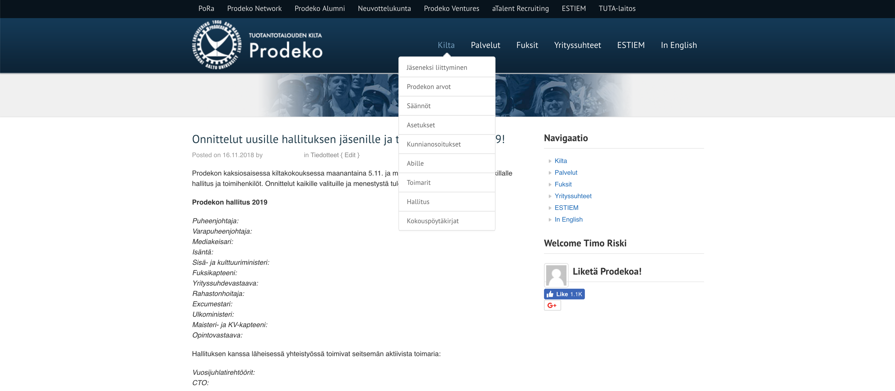

 
## About 
Prodeko is the Guild of Industrial Engineering and Management students at Aalto University. The new site offers **various improvements** over the old one including **automating weekly tasks** of different board members **saving tens or hundreds of hours of work per year**. 

## Technologies
Django + DjangoCMS + MySQL. Developed using Docker. Deployed to a standalone server through Apache.

## Features 
- [django-sass-processor](https://github.com/jrief/django-sass-processor) for SCSS 
- [unittest](https://docs.python.org/3/library/unittest.html#module-unittest) for testing 
- Internationalization & Localization in Finnish and English.
- Dynamic form submission + PDF generation from form data.
> *The reimbursement form is used to by guild members to reimburse expenses from the guild. The form is dynamic (e.g. form fields can be added and removed so that multiple reimbursements can be processed at once).*
- Google Drive API 
> *Downloading board meeting documents and attachments automatically.*
- Google Directory API
> *Automating the guild membership application process. Automatically managing mailing lists stored in G Suite.*
- Google Analytics
> *Custom GA events for AJAX form submissions using Google Tag Manager.*

## Old site
The old site ran on Wordpress and felt outdated for 2019. SEO was nonexistent as searching for "tuotantotalous" yielded prodeko.org on the fourth page of Google search results.

