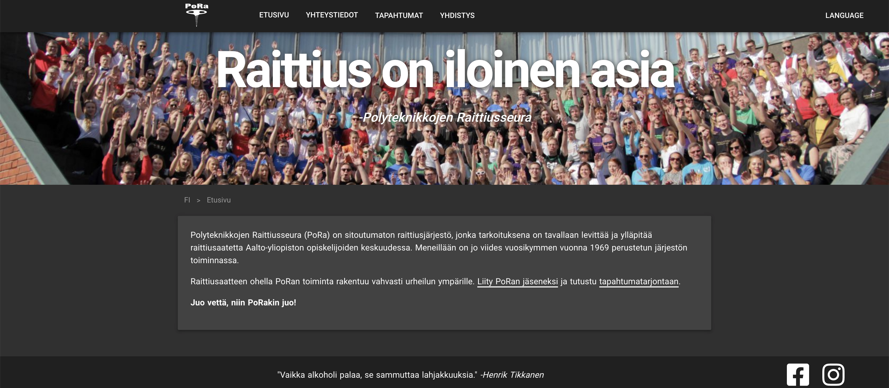

  <video autoplay muted loop>
    <source src="videos/raittiusseura-org.webm" type='video/webm' />
    <source src="videos/raittiusseura-org.mp4" type='video/mp4' />
     tag">
  </video>

## About 
Polyteknikkojen Raittiusseura (PoRa) is an association based in Aalto University. For the association's 50th anniversary, PoRa's website [pora.ayy.fi](https://raittiusseura.org) required a facelift.

## Technologies

Nuxt.js, Vue.js. Deployed using Netlify. Repository: https://github.com/rriski/pora-site.

## Features
- Built with [Nuxt.js](https://nuxtjs.org/)
- Headless CMS with [Storyblok](https://www.storyblok.com/)
- Internationalization in Finnish, Netherlands and English
- [Prettier](https://prettier.io/) for code style
- [ESLint](https://eslint.org/) (based on eslint-plugin-vue)
- Google Calendar Javascript API to fetch upcoming events
