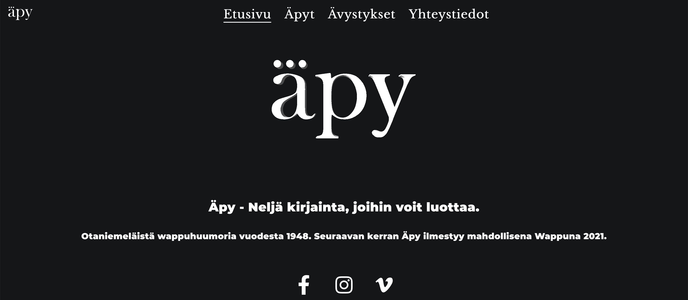

  <video autoplay muted loop>
    <source src="videos/apy-fi.webm" type='video/webm' />
    <source src="videos/apy-fi.mp4" type='video/mp4' />
     tag">
  </video>

## About 
The Finnish humour publication Äpy is published odd years during the Finnish first of May festivities. The website [www.äpy.fi](https://www.apy.fi) features old Äpy's and serves as the digital front for the 70 year old Wappu magazine.

## Technologiess

Gatsby, React. Deployed using Netlify. Repository: https://github.com/wappulehti-apy/apy-fi.

## Features
- Built with [Gatsby](https://www.gatsbyjs.org/)
- CSS in JS with [Emotion](https://emotion.sh/docs/introduction) v10
- 3D logo using [Three.js](https://threejs.org/)
- [Prettier](https://prettier.io/) for code style
- [ESLint](https://eslint.org/) (based on eslint-plugin-react)
- [Stylelint](https://stylelint.io/) for SCSS linting
- Built in theming for the unique look of each Äpy project
- Most social + meta tags in one component (SEO)
- Generated media queries for easy use
