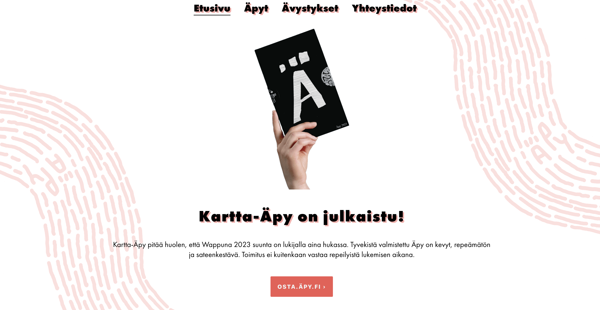

  <video autoplay muted loop>
    <source src="videos/apy-fi.webm" type='video/webm' />
    <source src="videos/apy-fi.mp4" type='video/mp4' />
     tag">
  </video>

## About 
The Finnish humour magazine Äpy is one of the cornerstones of the Finnish first of May festivities. Built with Gatsby, the [www.äpy.fi](https://www.apy.fi) website offers various improvements over the old WordPress powered site.

## Technologies
Gatsby v2, React. Deployed using [Netlify](https://www.netlify.com/).

## Features
- Built with [gatsby v2](https://www.gatsbyjs.org/)
- CSS in JS with [emotion](https://emotion.sh/docs/introduction) v10
- 3D logo using [three-js](https://threejs.org/)
- [Prettier](https://prettier.io/) for code style
- [ESLint](https://eslint.org/) (based on eslint-plugin-react)
- [Stylelint](https://stylelint.io/) for SCSS linting
- Most social + meta tags in one component (SEO)
- Generated media queries for easy use
